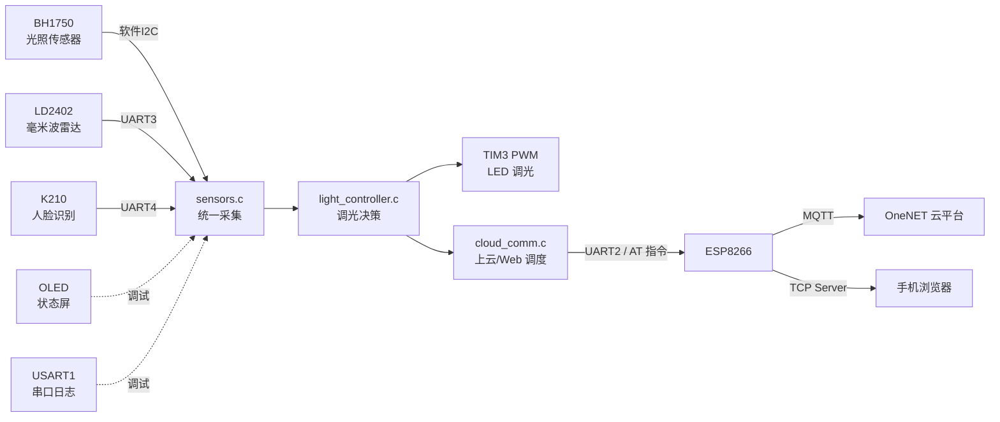

# 智能照明控制系统

基于 **STM32F407** 的多传感器融合智能照明系统：通过光照、毫米波雷达、人脸识别三路感知数据自动调节 LED 亮度，并支持 **OneNET 云平台远程监控** 与 **局域网 Web 页面手动控制**。

> 竞赛项目 · 裸机开发（无 RTOS）· STM32 HAL 库 · Keil MDK

---

## 功能特性

- **自动调光** —— 依据「环境光照 + 是否有人 + 人数」按优先级策略自动计算亮度，无人时自动关灯
- **多传感器融合** —— BH1750 光照 / LD2402 毫米波人体雷达 / K210 人脸识别，统一采集为一份数据快照
- **PWM 调光输出** —— TIM3 输出 1kHz PWM，占空比 0~999 对应 0~100% 亮度
- **云端上报** —— ESP8266 通过 MQTT 将亮度状态上报 OneNET 物模型，支持断线自动重连
- **本地 Web 控制** —— ESP8266 作 TCP Server，手机浏览器访问即可查看实时状态、切换手动/自动模式、手动调光
- **可靠性设计** —— 独立看门狗（IWDG）兜底、传感器读取重试、UART 错误标志清理、全链路串口日志

---

## 系统架构



### 三层解耦设计

系统按职责划分为三层，模块之间通过全局状态结构体 `g_app`（`AppState_t`）交换数据，而非直接互相调用内部实现：

| 层 | 文件 | 职责 |
|---|---|---|
| 采集层 | `sensors.c` | 汇总三路传感器为统一的 `SensorData_t` 快照 |
| 决策层 | `light_controller.c` | 输入传感器快照，按优先级策略输出目标亮度 |
| 传输层 | `cloud_comm.c` | 负责云端上报与 Web 服务调度 |

这样分层的好处：**上层不关心数据从哪来**——更换或新增传感器只需改采集层，调整调光策略只动决策层，迁移云平台只改传输层，互不影响。

---

## 硬件清单

| 模块 | 型号 | 接口 | 引脚 / 参数 |
|---|---|---|---|
| 主控 | STM32F407VET6 | — | 168MHz，512KB Flash / 192KB RAM |
| 光照传感器 | BH1750 | 软件 I2C | PB6(SCL) / PB7(SDA)，地址 `0x23`，H2 模式 |
| 人体雷达 | LD2402 毫米波 | UART3 | PB10/PB11，115200 |
| 人脸识别 | K210 | UART4 | PC10/PC11，115200 |
| WiFi 模块 | ESP8266 | UART2 | PA3(RX) / PD5(TX)，115200 |
| 显示 | SSD1306 OLED 128×64 | 软件 I2C | PA2(SCL) / PA4(SDA)，地址 `0x78` |
| LED 驱动 | PWM 输出 | TIM3_CH2 | PA7，1kHz |
| 调试串口 | 串口日志 | USART1 | PA9/PA10，9600 |
| 状态指示 | 板载 LED | GPIO | PC0（启动闪 3 次） |

---

## 软件设计

### 1. 裸机超级循环与任务调度

主程序不使用 RTOS，采用**超级循环 + 软件定时**结构。所有任务的周期控制统一使用 `HAL_GetTick()` 差值判断，没有 RTOS tick 依赖：

| 任务 | 调用频率 | 说明 |
|---|---|---|
| 喂看门狗 | 每圈 | 主循环首行 |
| 雷达 / K210 / Web 解析 | 每圈 | I/O 轮询，需及时响应 |
| 传感器采集 | 200ms | 内部节流 |
| 亮度写入 PWM | 变化时 | 值改变才写寄存器，避免无谓刷新 |
| 云端上报 | 20s | 高频遥测降频，节省流量 |
| 断线重连 | 30s | 避免失败风暴 |
| OLED / 串口日志 | 1s | 状态刷新 |

**为什么不用 RTOS**：任务均为周期性、无严格实时性要求（200ms 级响应足够）；裸机结构简单、无调度开销与优先级反转风险；中断只负责收字节，重活全在主循环，天然减少竞态。

### 2. PWM 调光频率推导

```
系统时钟 SYSCLK = 168MHz
TIM3 挂 APB1：APB1 分频 /4 → PCLK1 = 42MHz
APB1 预分频 ≠ 1 时定时器时钟翻倍 → 定时器时钟 = 84MHz

预分频 Prescaler = 84  → 计数时钟 = 84MHz / 84 = 1MHz  (1 tick = 1μs)
周期    Period   = 1000 → 溢出周期 = 1000μs

PWM 频率 = 1MHz / 1000 = 1kHz
```

占空比 0~999 线性对应 0~100% 亮度，`LED_SetBrightness()` 内部折算为 CCR 值。

### 3. 调光决策策略（优先级从高到低）

| 优先级 | 条件 | 输出 |
|---|---|---|
| 1 | 手动模式 | 手动设定值 |
| 2 | 无人 | 0%（关灯） |
| 3 | 检测到 ≥2 人 | 100% |
| 4 | 单人 | 按环境光照分档：90% / 60% / 30% / 10% / 0% |
| 5 | 仅雷达有人（未识别人脸） | 50% |

### 4. 传感器驱动要点

**BH1750 光照** —— 软件 I2C 位操作模拟时序（GPIO 拉高拉低 + DWT 微秒延时）。H2 高分辨率模式下，实际光照值换算为 `lux = raw / 1.2`。读写均带 `Wait_Ack` 重试（最多 3 次），避免 I2C 偶发 ACK 丢失导致卡死。

**LD2402 毫米波雷达** —— UART3 接收 ASCII 行 `distance:XX`。判人算法：

1. **背景学习**：启动时采集 30 个样本，取**最小值**作为背景基准距离（取最小而非均值，因为背景本质是最近静态目标到雷达的距离）
2. **判人**：当前距离与背景偏差 `> 6cm` 判定有人
3. **防抖**：判定有人后至少保持 3 秒，防止瞬间抖动误判
4. **退场**：偏差持续回到阈值内达 12 秒才判定无人，避免灯光频繁闪烁

**K210 人脸识别** —— UART4 接收自定义帧，STM32 侧用状态机解析（K210 端算法非本仓库工作）：

```
0x24 帧头 | length | class_num | class_group | data_num | data... | CRC(和%256) | 0x23 帧尾
```

串口是字节流、本身无边界，靠帧头帧尾 + 长度 + 校验把一帧从流中切分出来并验错，这是自定义通信协议的通用设计。

### 5. 上云：ESP8266 + MQTT

USART2 以 AT 指令驱动 ESP8266，流程为 `WiFi 连接 → TCP Server → MQTT 三连`：

```c
AT+MQTTUSERCFG=0,1,"<设备名>","<产品ID>","<token>",0,0,""   // 鉴权配置
AT+MQTTCONN=0,"mqtts.heclouds.com",1883,1                    // 连接（末位开启自动重连）
AT+MQTTSUB=0,"$sys/{产品ID}/{设备名}/thing/property/post/reply",0   // 订阅上报响应
AT+MQTTSUB=0,"$sys/{产品ID}/{设备名}/thing/property/set",0          // 订阅云端下发
```

- **鉴权 token** 采用 OneNET 的 md5 签名方案，签名字符串必须为 `et\nmethod\nres\nversion` 四段按序换行拼接后再做 HMAC-MD5，顺序或内容有误会直接导致鉴权失败（本项目曾在此处踩坑排查）
- **上报**：`AT+MQTTPUBRAW` 分两步发送——先声明长度并等待 `>` 提示符，再发送原始载荷，QoS 0
- **载荷格式**：`{"id":"123456","params":{"light_state":{"value":N}}}`
- **断线处理**：`Cloud_TryReconnect()` 以 30 秒节流重跑整条链路，ESP8266 自身也配置了自动重连

**AT 指令等待技巧**：`ESP_WaitResp()` 在发送 AT 指令期间临时关闭 UART 接收中断、改为轮询读取数据寄存器，并主动清除 ORE/FE 错误标志，收完再重新开启中断——避免中断与轮询抢字节或错误标志累积导致串口锁死。

### 6. 本地 Web 控制面板

ESP8266 通过 `AT+CIPSERVER` 作为 TCP 服务器，MCU 侧完成 HTTP 请求解析与路由（`web_server.c`），页面为内嵌在固件中的单页 HTML：

| 路由 | 说明 |
|---|---|
| `GET /` | 返回控制面板页面 |
| `GET /api/status` | 返回当前状态的 JSON |
| `GET /api/set?b=<0-100>&m=<auto\|manual>` | 设置亮度 / 切换手动自动模式 |

前端 JS 每 2 秒轮询 `/api/status` 刷新显示，按钮调用 `/api/set` 下发控制。

### 7. 可靠性设计

- **独立看门狗（IWDG）**：LSI 32kHz → 64 分频（500Hz），重载值 2000 → **4 秒超时**，主循环首行喂狗。**必须在 `Cloud_Init()` 之后启动**——网络连接耗时不确定，若先启动看门狗，初始化阶段来不及喂狗会导致上电反复复位
- **DWT 延时**：使用内核 DWT 周期计数器实现微秒级精确延时（软件 I2C 时序、AT 指令间隔），相比基于 SysTick 的 `HAL_Delay`（1ms、中断中失效）更精细
- **中断最小化**：UART 接收中断只把字节存入缓冲区，协议解析全部放主循环执行
- **调试三件套**：USART1 全程串口日志、OLED 四行状态屏（运行时间/光照/亮度/人数/网络状态）、PC0 启动闪灯 + 运行时间计数器（用于判断系统是否反复重启）

---

## 目录结构

```
LED2.0带网站/
├── Core/
│   ├── Inc/                   头文件（各模块对外接口）
│   └── Src/
│       ├── main.c             初始化 + 超级循环调度
│       ├── sensors.c          传感器统一采集（200ms 节流）
│       ├── light_controller.c 调光决策（优先级策略）
│       ├── cloud_comm.c       上云调度（20s 上传 / 30s 重连）
│       ├── esp8266.c          AT 指令驱动 + MQTT 接入
│       ├── web_server.c       本地 Web 服务（HTTP 解析 + 内嵌页面）
│       ├── BH1750.c           光照传感器驱动
│       ├── soft_i2c.c         软件 I2C 位操作
│       ├── ld2402_uart.c      毫米波雷达驱动（背景学习 + 防抖）
│       ├── k210_uart.c        人脸检测串口帧解析
│       ├── led_pwm.c          PWM 调光输出
│       ├── OLED.c             SSD1306 显示驱动
│       ├── delay.c            DWT 微秒级延时
│       └── app_state.c        全局状态中枢
├── Drivers/                   STM32 HAL 库 / CMSIS
├── MDK-ARM/                   Keil MDK 工程
├── LED.ioc                    STM32CubeMX 工程配置
└── 5_yolo_face_detect_5.py    K210 端人脸识别脚本（MaixPy）
```

---

## 编译与烧录

**环境要求**：Keil MDK 5（ARM Compiler 5/6）、STM32F4xx Device Family Pack、ST-Link 调试器

**步骤**：

1. **创建 WiFi 凭据文件**（该文件含密码，已被 `.gitignore` 排除，仓库中不包含，需自行创建）：

   `Core/Inc/wifi_config.h`

   ```c
   #ifndef __WIFI_CONFIG_H
   #define __WIFI_CONFIG_H

   #define WIFI_SSID     "your_wifi_ssid"
   #define WIFI_PASS     "your_wifi_password"

   #endif
   ```

2. 使用 Keil 打开 `MDK-ARM/LED.uvprojx` 并编译
3. 通过 ST-Link 烧录
4. 连接 USART1（**9600** 波特率）查看启动日志；上电后 PC0 会闪烁 3 次表示系统启动

> 注：OneNET 的产品 ID、设备名与鉴权 token 位于 `Core/Src/esp8266.c`，需按自己的平台信息替换后方可正常上云。

---

## 已知限制与改进方向

- **云端下发未闭环**：已订阅 `thing/property/set` 主题且实现了 `MQTT_Get_Data()` 解析函数，但尚未接入主循环，当前手动控制走本地 Web 页面而非云端命令。接入方式为：主循环检测订阅消息到达 → 解析 value → 写入 `g_app.manual_brightness`
- **网络层为阻塞式**：重连流程顺序执行 WiFi → Server → MQTT，任一步阻塞会拖住整个主循环。可改为非阻塞状态机，每次循环推进一步
- **复位原因未判别**：未读取 `RCC->CSR` 的 `IWDGRSTF` 标志，无法确证某次重启是否由看门狗触发，只能靠运行时间归零间接推测
- **凭据硬编码**：设备凭据目前以明文写在源码中，生产环境应改用安全存储或 OTA 下发
- **任务规模扩展**：当前任务数较少，若继续增加，可迁移至 FreeRTOS 用独立任务 + 消息队列管理

---

## 说明

本项目为竞赛作品。系统包含的 **K210 人脸识别脚本（MaixPy）** 与 **Web 页面前端（HTML/CSS/JS）** 由团队成员负责，收录于仓库以便完整展示系统；固件侧（STM32 驱动、调光决策、串口协议解析、云端通信、Web 服务端逻辑）为本仓库主要工作内容。
